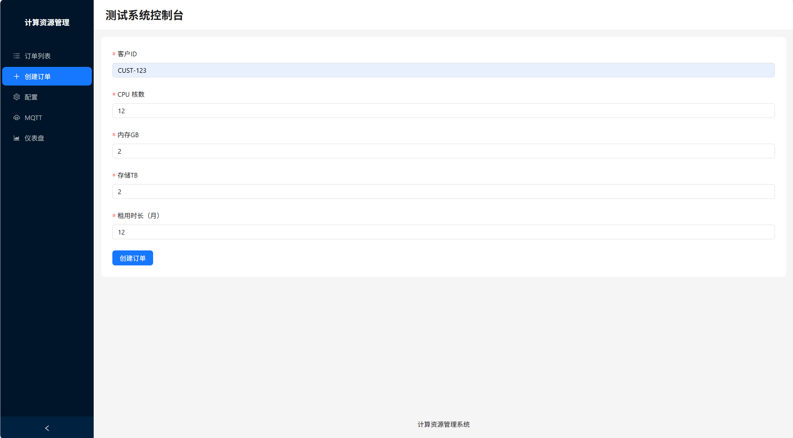

<p align="right">
  <a href="README.md">English</a> | <a href="README_zh.md">中文</a>
</p>

<h1 align="center">
  
  Industrial-Data-Simulator
</h1>

<p align="center">
  <b>A versatile industrial data source simulator for UNS</b><br>
</p>

<p align="center">
  <a href="https://github.com/FREEZONEX/Industrial-Data-Simulator/graphs/contributors">
    
  </a>
  <a href="https://github.com/FREEZONEX/Industrial-Data-Simulator/network/members">
    
  </a>
  <a href="https://github.com/FREEZONEX/Industrial-Data-Simulator/stargazers">
    
  </a>
  <a href="https://github.com/FREEZONEX/Industrial-Data-Simulator/issues">
    
  </a>
</p>

## 🧩 Project Overview
This project is an industrial data source simulator designed to emulate the temperature and cooling processes of a data center. It helps anyone interested in UNS (Unified Namespace) easily deploy and build a complete UNS architecture environment.  
The data can be divided into 2 main categories:  
### 1️⃣ Equipment Data Sources
| Equipment Name                          | Protocol         |
| ------------------------------          | ---------------- |
| Cooling Tower (CT-301)                  | Modbus TCP       |
| Chiller (Chiller-201)                   | Modbus TCP       |
| Pumps (CDWP-301 / CHWP-201)             | OPC UA           |
| Computer Room Air Handler (CRAH-101)    | BACnet           |
| Server Racks (Rack-A01 / Rack-A02 / …)  | MQTT             |
### 2️⃣ Software System Data
| System Name                  | Protocol / Access Method |
| -------                      | ---------------          |
| Compute source Order System  |  REST API Server         |
| Order Information Database   |  PostgreSQL              |

---

## 🚀 Quick Start  
```bash
docker-compose up -d
```
Access the frontend management interface at http://localhost:5000  
<p align="center">
    
</p>

## 📈 Data Changes
Data changes consist of **Fluctuation** ， **Simulation** and **Collection**:  
### 1. **Simulation**:
- Executed every second (`step=1`) to make the data changes close to real-world behavior.   
### 2. **Fluctuation**:
- Small random variations are applied on top of the current data.  
- Each change ranges within ±2%.  
- Default frequency is **once every 10 seconds**，adjustable dynamically via API.  
### 3. **Collection**:
- Represents the system’s sampling frequency of the simulated data, i.e., the period at which data is output to the server.  
- Default collection frequency is **once every 5 seconds**，also dynamically adjustable via API   

---

## 🛠 API Documentation  

### 1. Create Compute Resource Rental Orders  
**Endpoint:** `POST /api/v1/orders`  
**Description:** Create a new compute resource rental order.  
**Request Body (application/json):**  
```json
{
  "customer_id": "string",
  "requested_resources": {
    "cpu_cores": "integer",
    "memory_gb": "integer",
    "storage_tb": "integer"
  },
  "duration_months": "integer"
}
```
⚠️ Note: **The data simulation task will only start after the first order is created.**

### 2. Query Historical Orders
**Endpoint:** `GET /api/v1/orders`  
**Description:** Retrieve historical compute resource rental orders.  
**Query Parameters:**  
- `customer_id` (string, optional): Filter by customer ID  
- `status` (string, optional): Filter by order status (e.g., 'Active', 'Completed', 'Processing')  

**Successful Response:** `200 OK`  

### 3. Update Data Change Rates
**Endpoint:** `POST /api/v1/config`  
**Description:** Update the rates of data simulation and fluctuation.  
**Request Body (application/json):**  
```json
{
  "SERVER_UPDATE_INTERNAL": "float",   // Server data update interval (seconds)
  "RANDOM_UPDATE_INTERVAL": "float"    // Data fluctuation update interval (seconds)
}
```
### 4. Select MQTT Broker
**Endpoint:** `POST /api/v1/mqtt`  
**Description:** Retrieve the current values of all data points.  
**Request Body (application/json):**  
```json
{
    "broker": "string",
    "port": "interger",
}
```

### 5. Query Current Data
**Endpoint:** `POST /api/v1/dashboard`  
**Description:** Retrieve the current values of all data points.  
**查Query Parameters:** None  
**Successful Response:** `200 OK`  

---

## 📡 Supported Protocols & Mappings  

### 🔹 Modbus TCP (`localhost:5020`)  
- Devices: `CT-301`, `Chiller-201`  
All data is stored in Holding Registers. Address mapping is as follows:

| Unit ID | Device Name     | Data Point Name                  | FC | Address | Quantity | Description                                  |
| ------- | --------------- | -------------------------------- | -- | ------- | -------- | -------------------------------------------- |
| **1**   | **CT-301**      | state                            | 03 | 0       | 4        | Status string (string)                       |
|         |                 | tower_top_air_temp               | 03 | 4       | 2        | Cooling tower top air temperature (float)    |
|         |                 | tower_basin_temp                 | 03 | 6       | 2        | Cooling tower basin temperature (float)      |
|         |                 | entering_water_temp              | 03 | 8       | 2        | Chilled water entering temperature (float)   |
|         |                 | fan_speed                        | 03 | 10      | 2        | Fan speed (float)                            |
|         |                 | basin_water_level                | 03 | 12      | 2        | Basin water level (float)                    |
| **2**   | **Chiller-201** | condenser_entering_water_temp    | 03 | 0       | 2        | Condenser entering water temperature (float) |
|         |                 | condenser_leaving_water_temp     | 03 | 2       | 2        | Condenser leaving water temperature (float)  |
|         |                 | refrigerant_condensing_pressure  | 03 | 4       | 2        | Refrigerant condensing pressure (float)      |
|         |                 | state                            | 03 | 6       | 4        | Status string (string)                       |
|         |                 | chilled_water_leaving_temp       | 03 | 10      | 2        | Chilled water leaving temperature (float)    |
|         |                 | chilled_water_entering_temp      | 03 | 12      | 2        | Chilled water entering temperature (float)   |
|         |                 | refrigerant_evaporating_pressure | 03 | 14      | 2        | Refrigerant evaporating pressure (float)     |
|         |                 | compressor_load                  | 03 | 16      | 2        | Compressor load (float)                      |
|         |                 | total_power_consumption          | 03 | 18      | 2        | Total power consumption (float)              |


### 🔹 OPC UA (`opc.tcp://localhost:4840/`)  
- Devices: `CDWP-301`, `CHWP-201`  
Node identifiers are as follows:

| Device Name  | Data Point Name    | Node ID                                   | Description                      |
| ------------ | ------------------ | ----------------------------------------- | -------------------------------- |
| **CDWP-301** | state              | `ns=2;s=CDWP-301.state`                   | Pump operation status (string)   |
|              | flow_rate          | `ns=2;s=CDWP-301.edge.flow_rate`          | Flow rate (float)                |
|              | discharge_pressure | `ns=2;s=CDWP-301.edge.discharge_pressure` | Discharge pressure (float)       |
|              | power_consumption  | `ns=2;s=CDWP-301.edge.powerconsumption`   | Power consumption (float)        |
| **CHWP-201** | state              | `ns=2;s=CHWP-201.state`                   | Pump operation status (string)   |
|              | flow_rate          | `ns=2;s=CHWP-201.edge.flow_rate`          | Flow rate (float)                |
|              | discharge_pressure | `ns=2;s=CHWP-201.edge.discharge_pressure` | Discharge pressure (float)       |
|              | power_consumption  | `ns=2;s=CHWP-201.edge.powerconsumption`   | Power consumption (float)        |


### 🔹 BACnet (`localhost:47808`)  
- Device: `CRAH-101`  
Object types, instance numbers, and properties are as follows:  

| Device Name  | Data Point Name              | Object Type           | Type | Instance | Property Id | Description                          |
| ------------ | ---------------------------- | --------------------- | ---- | -------- | ----------- | ------------------------------------ |
| **CRAH-101** | return_air_temp              | Analog Input          | 0    | 0        | 85          | Return air temperature (float)       |
|              | supply_air_temp              | Analog Input          | 0    | 1        | 85          | Supply air temperature (float)       |
|              | chilled_water_valve_position | Analog Input          | 0    | 2        | 85          | Chilled water valve position (float) |
|              | fan_speed                    | Analog Input          | 0    | 3        | 85          | Fan speed (float)                    |
|              | status                       | Characterstring Value | 40   | 0        | 85          | Operation status (string)            |


### 🔹 MQTT (`default Broker: localhost:1883`)  
- Publishes 7 topics  

| Topic Path                           | Data Type | Description                          |
| ------------------------------------ | --------- | ------------------------------------ |
| `IT/DataHall-1/kpi/totalITLoad`      | Float     | Total IT load power in the data hall |
| `datacenter/Rack-A01/edge/powerDraw` | Float     | Real-time power of Rack A01          |
| `datacenter/Rack-A02/edge/powerDraw` | Float     | Real-time power of Rack A02          |
| `datacenter/Rack-A03/edge/powerDraw` | Float     | Real-time power of Rack A03          |
| `datacenter/Rack-A04/edge/powerDraw` | Float     | Real-time power of Rack A04          |
| `datacenter/Rack-A05/edge/powerDraw` | Float     | Real-time power of Rack A05          |
| `datacenter/Rack-A06/edge/powerDraw` | Float     | Real-time power of Rack A06          |

---

## 📈 Data Simulation Workflow  
### **1. Compute Source Request:** 
Customers submit a compute resource order via the REST API.  
### **2. IT Logic Processing:** 
The order system processes the order and “deploys” the additional computed power consumption to a specific server rack (Rack-A01). The current rack and the total IT load in the data hall increase accordingly.  
### **3. System Adaptive Regulation:** 
Based on the primary cooling loop, chiller units, and secondary cooling loop, the system responds to the increased load.  
- Primary Cooling Loop (Air ↔ Water)   
Core Function: Transfers heat from air to chilled water, serving as the starting point for internal heat exchange in the data center.    
Main logic：  
  - `returnAirTemp` is determined by IT load (`totalITLoad`) and has thermal inertia.  
  - CRAH adjusts `fanSpeed` and `chilledWaterValvePosition` to control `supplyAirTemp`.  
  - When return air temperature rises, the system automatically increases fan speed and valve opening to achieve self-regulated cooling.

- Chiller Unit (Water ↔ Water)  
Core Function: Connects the secondary cooling loop with the primary loop, transferring heat from chilled water to condenser water.  
Main logic:  
  - `chilledWaterEnteringTemp` reflects the thermal load of the secondary cooling loop.
  - Compressor load (`compressorLoad`) is proportional to the heat load, driving changes in energy consumption (`totalPowerConsumption`).
  - Leaving water temperature (`chilledWaterLeavingTemp`) is determined by both cooling load and compressor performance, representing the cooling effect.

- Primary Cooling Loop (Water ↔ Environment)  
Core Function: Ultimately dissipates heat to the external environment.  
Main Logic:  
  - Condenser leaving water temperature (`condenserLeavingWaterTemp`) is higher than entering temperature, transferring heat to the cooling tower.
  - Cooling tower fan speed (`fanSpeed`) adjusts heat dissipation efficiency, and towerBasinTemp is influenced by ambient temperature and humidity.
  - Condenser water pump (`CDWP-301`) ensures circulation, with its power consumption proportional to system load.
